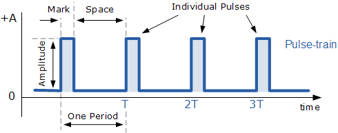
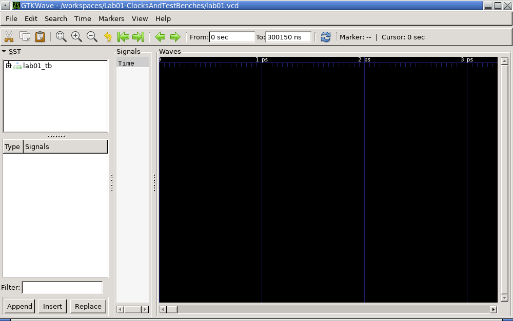
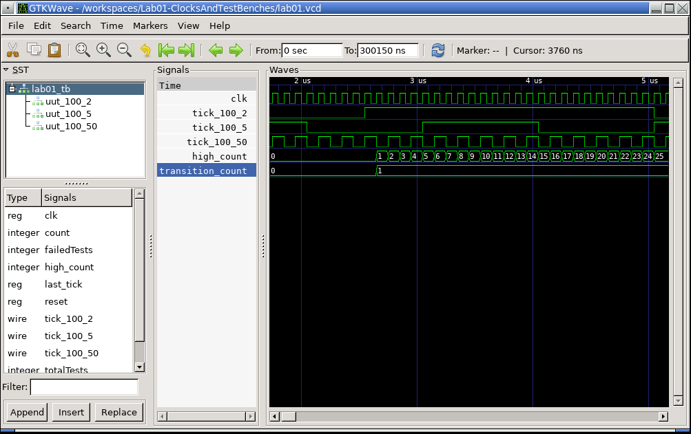

# Lab 1 - Clocks and Test Benches
 ## Introduction

Welcome to cs161L. This lab will be an exploration of datapaths and an 
introduction to the Verilog language. For this lab assignment, You will also be
getting familiar with the development environment. For the first few labs we 
sill use an open source tool called Icaraus Verilog for sytnthesizing and 
simulating hardware, and GTKwave to view wave forms. These open source tools 
are available for Windows, Mac OS X (even for M1 macs), and Linux. You can also
use these tools in a web browser (this means you can even use a chromebook to 
do these first few assignments). This GitHub repository contains all the 
configuration file necessary to run these tools inside of GitHub's Codespaces 
(but more about that later).

To begin learning about the Verilog Hardware Definition Language (HDL), I 
highly recommend these [tutorials](https://nandland.com/learn-verilog/) for 
learning Verilog in general. You may also use these additional Verilog examples
[​here](http://www.asic-world.com/verilog/veritut.html)​ as a guide.

The goal of this lab is to implement a simple clock multiplier and write your
first testbench.

### Clocks and Clock Multipliers

As you probably know by now, a clock is a special circuit that constantly 
changes between the values 0, and 1 (or low voltage and high voltage). 
Some of the characteristics of this special circuit are the frequency, how
often per second the clock changes from 0 to 1 and back to zero again, the 
period, how long one cycle of the clock takes, and the load. Since the 
frequency and period are related by the simple formula $f=1/p$, well focus
on the frequency and load for this lab. The test bench you will write for
this assignment will verify that your clock is exhibiting the correct 
frequency and load.

The frequency of a clock is measured with the unit Herz(Hz) which means per
second. Clocks should have the same period for each transition between 1 and 
0, and therefore also a consistent frequency. The image below shows a 
typlical waveform of a clock.

In the image above you will notice that the time spent at the values 0 and 1
are approximately the same. The percentage of time spent at 1 value is called
the load. In the image above, the load is 50% because the clocks spends an 
equal amount of time at each value. In this lab you will be tasked with 
maintaining this load of 50%. 

Here's an example of a load that is not 50%.

### Test Benches

A test bench is Verilog code that instantiates an instance of a Verilog module
to test its behavior in order to verifiy that it behaves in a specified way.
This instantiated module is often referred to as the unit under test, or UUT 
for short. Often in a test bench, the module is named `uut`, but this is not 
required.

One challenge of writing Verilog code is retraining your mind to think in 
parallel, rather than sequentially, like most software programmers are used
to. However, for test benches, we often need to go back to sequential 
thinking. We'll discuss techniques for doing that in this and future lab
assignments.

Test benches are considered non-sythesizable. In other words, no actual 
circuits will be generated either in an ASIC or FPGA for this code. Rahter this
code is meant to only be simulated.

## Prelab

The prelab work for this lab assignment is to be prepared for the lab by 
installing all the necessary software.

For now follow these steps either before the actual lab, or during the lab 
session.

### Installing and using the necessary tools

The tools necessary for this lab, and many future labs, are Icarus Verilog, 
Digital schmatic capture and GTKwave. Think of Icarus Verilog as akin to the 
compiler of your favorite programming language. You'll use it to synthesize 
(similar to compile) your verilog code into a simulation executable 
(actually a script that acts like the hardware to allow testing before actually
committing to an [ASIC](https://en.wikipedia.org/wiki/Application-specific_integrated_circuit) 
or [FPGA](https://en.wikipedia.org/wiki/Field-programmable_gate_array) (look 
those terms up). This script is usually a test bench that instantiates the 
modules you write in Verilog, and prints out testing/debugging information to 
the screen, as well as output a capture file that contains information about 
the timings of all the binary signals in your simulation. This file is then 
read by GTKwave so that you can visualize what happened when your test bench 
ran. This visualization is called a waveform. You'll use this throughout the 
quarter to dive deep into debugging the signals in your hardware designs.
Digital is a new tool we are using this quarter. In previous instances of this
course, the most difficult part of programming in Verilog is visualizing the 
solution. Digital is a schematic capture program that will assist you in 
visualizing the solution and then generate Verilog.

The lab assignments for this course will involve all three tools used together
to create solutions to the problems described.

OK, now that we know what the tools are, let's talk about how to install and 
use them. Below is a table with links to install these applications for all the
relavent platforms. Follow these directions from these links to install the tools.

|Tool|Platform|Link|
|----|--------|----|
|Icarus Verilog| Windows  | [Link](https://bleyer.org/icarus/) |
|              | Mac OS X | [Link](https://youtu.be/V7zlAAjid98) |
|              | Linux    | [Link](https://iverilog.fandom.com/wiki/Installation_Guide) |
|GTKwave       | Windows  | [Link](https://gtkwave.sourceforge.net/) |
|              | Mac OS X | [Link](https://gtkwave.sourceforge.net/) |
|              | Linux    | [Link](https://gtkwave.sourceforge.net/) |
|Digital       | All      | [Link](https://github.com/hneemann/Digital/releases/latest/download/Digital.zip )|

Digital requires that the Java Runtime Environment(JRE) be installed. You can 
get directions for this runtime for Windows and Mac OS X 
[here](https://www.java.com/en/download/manual.jsp). For Linux, you can go to 
OpenJDK [here](https://openjdk.org/install/).

#### Using these tools in the browser

GitHub's Codespaces allows users to run development environments in the cloud. 
Anyone with a free GitHub account gets up to 120 hours a month of free time
on this application. 

To start a Codespace for this project, which already has Icarus Verilog, 
Digital and GTKwave installed, click on Code -> Codespaces -> Create a 
Codespace on Main.  Do this in your repository, not the template you used to 
create your repository. Directions on how to create your repository from the 
template are outlined below. This will start the build process for the 
Codespace, which can take several minutes, so be patient. Once you've created 
the Codespace you can do development in the browser and run Digital and GTKwave 
in another browser tab. This process will be demonstrated in the lab session. 
One last note, Codespaces can be run in Visual Studio Code, as well.

### Getting started

Once your development environment is setup, you can create a repository using 
the original GitHub repository as a template. This means you must have a GitHub
account. If you do not, create one before moving on. A free account is all that
is required and you may use any email address you want.

To create your repository from the template, got to "Use this template" -> 
"Create a new repository". On the next page, name your new repository, 
Lab01-ClocksAndTestBenches is a good choice. Be sure to select Private to 
ensure that others cannot see this repository. Any repository that is public 
will have points deducted from it. This is easily fixable if you forget, and 
you can always submit to Gradescope after changing to get full credit. Finally,
click on "Create repository from template", and you're ready to go.

Next, you will write the test bench ([lab01_tb.v](./lab01_tb.v)) for the clock 
multiplier you will be designing. The test bench should include tests for the 
boundary conditions and edge cases (as well as typical cases). You should 
describe the test cases in comments in your test bench. You will also describe 
your test cases in your lab report.

## Deliverables

For this lab you are expected to build an Clock Multiplier that takes in a 
source clock and outputs a tick at a different frequency. Using Verilog 
parameters, your code will specify the frequency of the source clock and the
frequency of the output tick. Your verilog code with then use counters that
increment as the source clock ticks, to control the value of the output ticks.

Second, you will create a schmatic capture of a simple circuit that blinks an
LED at a specified frequency using you clock multiplier.

And finally, you'll write a lab report that outlines the tests you ran, and 
shows that you ran GTKwave to view the waveform from running the test bench. 

### Clock Multiplier

The Clock Multiplier Verilog code shall be in the file [gen_tick.v](./gen_tick.v).
This file will define exactly one module that takes in a source clock (`src_clk`), and 
enable (`enable`) bit and outputs a tick (`tick`) at the specified frequency. Additionally, this
module will accept two parameters `SRC_FREQ`, the frequency of the source clock,
and `TICK_FREQ`, the frequency of the output tick.

In the lab we will discuss stragies for implementing this module.

#### Blinking an LED in Digital

In Digital you will also create the following schematic capture that implements 
a blinking LED whos frequncy is controlled by the `gen_tick` module you created
above.

It will look like this:

To create this schematic capture open the Digital application. Next add the 
four modules, a clock input, constant value, external file, and LED. The 
following steps will help you add these modules.

1. For the clock input go to Components -> IO -> Clock Input
2. For the constant value go to Components -> Wires -> Constant value
3. For the external file go to Components -> Misc. -> VHDL/Verilog -> External file
4. For the LED go to Components -> IO -> LED

To connect the extneral file to your implementation of gen_tick, right click on
on the external file module. In the dialog shown, enter in the label as exactly
`gen_tick`, then click on the three dots next to Program Code. Navigate to your
file called `gen_tick.v` and click check. If everything worked properly, you're
good to go. If the dialog box finds erros, but sure to fix them and keep 
checking until there is not error dialog box.

Once you've laid out these components, contecting them with wires and save the
file as lab01.dig.

Next, set up the clock for simulation. Right click on the clock input module
and check 'Start real time clock'. Also, set the Frequency/Hz value to 
something large like 1000 or 5000. This value should match the `SRC_FREQ`
parameter in `gen_tick.v`.

Finally, test your module by clicking the play button at the top of Digital. 
You can change the rate of blinking by changing the `SRC_FREQ` and `TICK_FREQ`
in `gen_tick.v`.

You will turn in this file as part of the deliverables for this lab.

### Writing the Test Bench

First, start with the test bench code in [lab01_tb.v](./lab01_tb.v). One test 
case is already written for you. It's on lines 79 through 104. You can use this
code with only slight modifications, by copying and pasting it for each test 
case and reinitializing counter and then changing the which output tick to use
for the tests. The tests are checking that the load and frequency of the output
tick are correct. 

To test that the load is correct the test bench counts for  how many source 
clock ticks (`high_count`) the output tick is the value one. Since the test is 
set up to run 1000 clock ticks, for a 50% load this count should be 500 for a 
properly functioning clock multiplier. 

To test that the frequency of the output tick is correct, we count all the 
transitions of the output tick from 1 to 0. This count is stored in the 
register `transition_count`. Again, since the test runs for 1000 clock ticks,
the number of transitions from 1 to 0 should be 10 times output frequency. In 
other words, because `SRC_FREQ` is 100, and the number of clocks ticks of the 
test is 1000, then the correct `transition_count` is $1000 / 100 \times$ 
`TICK_FREQ`. In the specific case where `SRC_FREQ` = 100 and `TICK_FREQ` = 2,
the transition count should be 20 for a properly functioning clock multiplier.

You'll repeat these tests to test at least 3 different instance of the 
`gen_tick` module. That means you need to do the test give 2 more times. 

### Producing the Waveform

Once you've synthesized the code for the test bench and the clock multiplier 
module, you can run the test bench simulation script to make sure all the tests
pass. The code on lines 29 through 33 create a dumpfile that dumps all the 
values of the signals for each wire, register, module, etc. in the test bench.
The waveforms produced in this file can be viewed in GTKwave. For this lab the 
dumpfile is named lab01.vcd.

After producing the dumpfile, run GTKwave and go to File -> Open New Tab. 
Navigate to the file lab01.vcd and double click it. You should see something 
like the following: 

While this view is interesting, there is no waveform for you to view. You can 
click on the + sign next to lab01_tb to see all the values that can be viewed
in the waveform. However, each time you close the file you must select all the 
signals you want to see again. To avoid this tedious situation, you can load 
the file lab01.gtkw, which has a view of some important signals for this lab. 
Go to File -> Read Save File and navigate to and open the file lab01.gtkw.

Now you should see something like this:

Finally, you're going to drop a name marker and change its name to your name. 
In GTKwave, click anywhere in the time line of the wavform. You should then see
a vertical red line. Next, select Markers -> Drop Name Marker. There should now
be a letter A above the marker line you created on the time line. Now select 
Markers -> Show Change Marker Data. For row A, type your name in the right hand
box next to the time stamp for your marker. You should then see your name in 
the time line just above the marker you created. Take a screen capture of this 
window to turn in as part of your lab report to prove that you ran GTKwave.

### The Lab Report

Now create a file name REPORT.md and use GitHub markdown to write your lab 
report. This lab report will be short and contains only two sections. The first
section is a description of each test case you added to the test bench. The 
second section just contains the screen shot you took of the waveform file from
your test bench that contains a marker with you name. 

Make sure to add this file to your repository and the commit and push the 
repository to GitHub. You'll submit your lab to Gradescrope using the GitHub 
repository.

## Submission:

Each student **​must**​ turn in their repository from GitHub to Gradescope. The 
contents of which should be:
- A REPORT.md file with your name and email address, and the content described 
above
- All Verilog file(s) used in this lab (implementation and test benches).

**If your file does not synthesize or simulate properly, you will receive a 0 
on the lab.**
